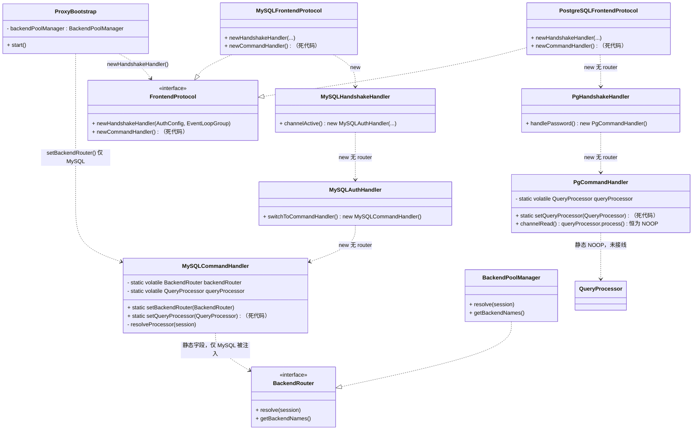
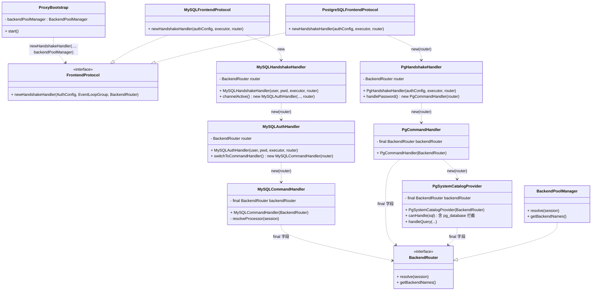
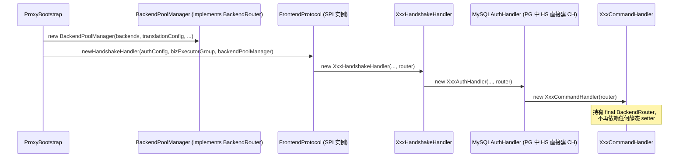
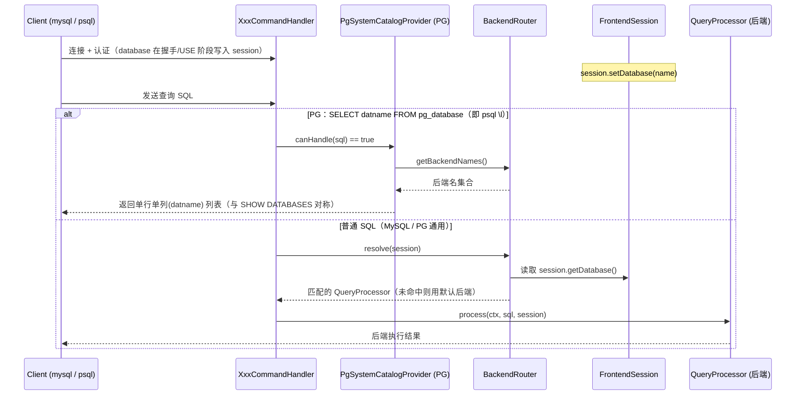

# SDT Proxy 后端路由器注入改造 —— 最终修订版架构方案

> **文档类型**：架构设计方案（仅方案分析，不修改任何业务源码）
> **适用范围**：`sdtp-protocol` / `sdtp-protocol-mysql` / `sdtp-protocol-pg` / `sdtp-server`（涉及 `sdtp-core`、`sdtp-backend` 已有接口）
> **版本**：v2（整合用户两个拍板点后的定稿）
> **作者**：架构师（高见远）
> **日期**：2025-07-21

---

## 一、背景与目标

### 1.1 背景

SDT Proxy 当前通过 `FrontendProtocol` SPI 接口（`sdtp-protocol`）加载 MySQL / PostgreSQL 前端协议实现，
后端由 `BackendPoolManager`（`sdtp-backend`，实现 `BackendRouter` 接口）按 `session.database` 名路由到对应 `QueryProcessor`。
上一轮（v1）方案已定位两类核心问题：

1. **PG 没有等价后端接线**：`ProxyBootstrap.java:112` 只调用了 `MySQLCommandHandler.setBackendRouter(backendPoolManager)`，
   且仅管 MySQL；`PgCommandHandler` 的 `queryProcessor` 永远停在 `QueryProcessor.NOOP`，PG 无论单 / 多后端都无法真正转发到后端。
2. **静态 setter 注入反模式**：`static volatile BackendRouter / QueryProcessor` + 静态 setter 带来一系列工程缺陷。

本轮（v2）在 v1 基础上，整合了用户对两个待确认点的拍板，并吸收了 Q1~Q5 的全部答复，形成可直接交予工程师落地的**定稿方案**。

### 1.2 目标

- 让 **MySQL 与 PostgreSQL 对称地**通过后端路由器按 `session.database` 路由，消除「PG 没接线」的现状。
- 用**构造器注入**替代**静态 setter 反模式**，消除全局可变状态、可测性差、同 JVM 多实例串扰、启动时序竞态等问题。
- 删除经全仓 grep 确认的**死代码**（`newCommandHandler()` 工厂方法、`setQueryProcessor` 捷径及其静态字段），降低误导与维护成本。
- 让 PG 的「列出数据库」与 MySQL `SHOW DATABASES` **对齐**，均返回后端名集合。
- 保持 `sdtp-server` 仅依赖 `FrontendProtocol` SPI 接口，不耦合任何具体协议类（修复 PG 被遗漏的根因）。

### 1.3 本轮（v2）相较 v1 的关键变更点

| 项 | v1 → v2 变化 | 来源 |
|---|---|---|
| PG 列出数据库 | 新增对 `SELECT datname FROM pg_database`（及 psql `\l` 等价查询）的拦截，返回 `backendRouter.getBackendNames()`，与 MySQL `SHOW DATABASES` 对称 | **用户拍板①** |
| 删除 `newCommandHandler()` | 删除 `FrontendProtocol.newCommandHandler()` 接口方法及两个协议实现（实测零调用、无副作用） | **用户拍板②** |
| 注入入口修正 | `FrontendProtocol.newCommandHandler()` 本身也是死代码；命令处理器实际在各协议**握手 / 认证处理器**内部用 `new XxxCommandHandler()` 创建（`PgHandshakeHandler.java:169/172`、`MySQLAuthHandler.java:218/221`）。因此路由器必须从**握手处理器**那一层注入，而非工厂方法 | **关键修正** |
| 取消 `SingleBackendRouter` 适配器 | `BackendPoolManager` 本身支持 1~N 后端按名路由，不需要新增单后端适配器 | **Q5** |

---

## 二、现状与问题

### 2.1 问题①：PG 当前没有等价后端接线

- `ProxyBootstrap.java:112` 仅调用 `MySQLCommandHandler.setBackendRouter(backendPoolManager)`，是**唯一**一处路由器注入，且仅作用于 MySQL。
- `PgCommandHandler`（`sdtp-protocol-pg`）持有 `private static volatile QueryProcessor queryProcessor = QueryProcessor.NOOP;`
  且 `setQueryProcessor(...)` 经全仓 grep **零调用** → 静态死代码；转发行 `queryProcessor.process(...)`（line 131 / 214）恒走 `NOOP`。
- `PgCommandHandler.setQueryProcessor(...)` 与 `MySQLCommandHandler.setQueryProcessor(...)` 全仓零调用，均为死代码。
- **后果**：PG 协议无论单后端还是多后端，都无法把 SQL 真正转发到后端，等于「没接线的 MySQL 早期版」。

### 2.2 问题②：静态 setter 注入反模式（缺陷表）

`static volatile BackendRouter / QueryProcessor` + 静态 setter（`setBackendRouter` / `setQueryProcessor`）的缺陷：

| # | 缺陷 | 说明 | 影响 |
|---|------|------|------|
| D1 | 全局可变静态状态 | 路由器挂在类的 `static` 字段上，跨连接共享 | 单测用例间相互污染；同 JVM 多实例串扰 |
| D2 | 可测性差 | 无法为每个实例注入不同的 `BackendRouter` | 无法隔离测试单 / 多后端路由 |
| D3 | 启动时序竞态 | 必须先 `setBackendRouter` 再接受连接，否则 `backendRouter==null` 走 NOOP | 并发启动期请求可能命中未注入状态 |
| D4 | Bootstrap 耦合具体类 | `ProxyBootstrap` 直接 `import MySQLCommandHandler` 并调其静态方法 | **PG 被遗漏的根因**；违反 SPI 只依赖接口的设计 |
| D5 | SPI 工厂无参受限 | `FrontendProtocol.newCommandHandler()` 无参，只能事后硬塞路由器 | 注入点错配、时序不可控 |
| D6 | 死代码误导 | `setQueryProcessor` / `newCommandHandler()` 零调用却存在 | 维护者误以为存在「单后端」捷径 |
| D7 | 单 / 多后端无统一抽象 | 静态 `queryProcessor`（单后端）与 `backendRouter`（多后端）并存 | 语义分裂，PG 缺失其一 |

### 2.3 已确认事实（来自 Q1~Q5）

- **Q1**：全仓无其他 `FrontendProtocol` 实现 → 直接上方案 A，无需方案 B 过渡垫片。
- **Q2**：旧 `CommandHandler` 类（`com.translator.proxy.core.handler.CommandHandler`）已不存在源码，现存仅 `MySQLCommandHandler` 与 `PgCommandHandler` → 死的 `setQueryProcessor` 可安全删除。
- **Q3**：路由语义 = 按 `session.database` 名匹配后端、由路由器解析出 `QueryProcessor` 发起 SQL，与现有 `BackendRouter.resolve(session)` 一致。
- **Q4**：PG `session.getDatabase()` 由 StartupMessage 的 `database` 参数在握手阶段写入（`PgHandshakeHandler.java:143-145`），
  与 MySQL 用 `USE` / `COM_INIT_DB` 设置的路由键**语义一致**；PG 确有数据库枚举操作 `pg_database`。
- **Q5**：`QueryProcessor` 直设能力 = 老的「单后端」捷径 `setQueryProcessor`，零调用死代码，直接删；
  `BackendPoolManager` 本身支持 1~N 后端按名路由，**不需要新增 `SingleBackendRouter` 适配器**。

---

## 三、候选方案精简对比

| 维度 | 方案 A：构造器注入 + 工厂传参 | 方案 B：启动期钩子 `initBackend(BackendRouter)`（default 方法） | 方案 C：运行时从 channel/session 取路由器（service-locator） |
|------|------------------------------|------------------------------------------|----------------------------------------|
| 注入时机 | 构造时一次性注入，实例 `final` 持有 | 对象创建后、使用前由 Bootstrap 调钩子 | 每次请求时从 context 取 |
| 是否消除静态状态 | ✅ 完全消除 | ⚠️ 消除静态字段，但仍有「创建后未初始化」窗口 | ❌ 引入全局 locator，等价于隐性全局状态 |
| 可测性 | ✅ 高（构造即注入） | ⚠️ 中（需记得调钩子） | ❌ 低（依赖全局注册） |
| 时序竞态 | ✅ 无（构造即完备） | ⚠️ 仍有初始化窗口 | ❌ 依赖 locator 就绪 |
| 与 SPI 的契合 | ✅ 工厂方法直接传参 | ⚠️ 需改接口加 default 方法 | ❌ 破坏接口纯净 |
| 对现有代码的侵入 | 改构造器签名 | 加 default 方法 + 调用点 | 加全局 locator 注册 |
| 结论 | **推荐，直接采用** | 仅作过渡垫片用（本次不需要） | **不推荐** |

**结论**：Q1 已确认全仓仅一个 `FrontendProtocol` 实现家族，无需 B 过渡；C 会引入全局 locator，与「去静态化」目标相悖。
**直接采用方案 A（修正版）**：路由器经**握手处理器构造**注入 `BackendRouter`，MySQL / PG 对称。

---

## 四、推荐方案（方案 A 修正版）

### 4.1 核心思路

> **路由器经握手处理器构造注入 `BackendRouter`，MySQL / PG 对称。**

`sdtp-server` 在启动时只依赖 `FrontendProtocol` SPI 接口，把 `backendPoolManager`（实现了 `BackendRouter`）通过
`newHandshakeHandler(authConfig, executor, backendRouter)` 传下去；握手处理器构造器持有 `final BackendRouter`，
在认证完成切换命令处理器时，用 `new XxxCommandHandler(router)` 把路由器继续向下传递。
由此 `BackendRouter` 从「全局静态」变为「每个连接 handler 实例的 `final` 字段」。

**调用链（MySQL）**：
```
ProxyBootstrap.start()
  → frontendProtocol.newHandshakeHandler(authConfig, bizExecutorGroup, backendPoolManager)   // 改签名，加 router 参数
    → MySQLFrontendProtocol  new MySQLHandshakeHandler(authUser, authPassword, executor, router)
      → MySQLHandshakeHandler.channelActive()  new MySQLAuthHandler(authUser, authPassword, executor, router)
        → MySQLAuthHandler.switchToCommandHandler()  new MySQLCommandHandler(router)          // 改签名
```

**调用链（PG）**：
```
ProxyBootstrap.start()
  → frontendProtocol.newHandshakeHandler(authConfig, bizExecutorGroup, backendPoolManager)
    → PostgreSQLFrontendProtocol  new PgHandshakeHandler(authConfig, executor, router)
      → PgHandshakeHandler.handlePassword()  new PgCommandHandler(router)                      // 改签名
        → PgCommandHandler  new PgSystemCatalogProvider(router)                                 // pg_database 拦截需要
```

### 4.2 路由语义（保持不变）

- `BackendRouter.resolve(FrontendSession session)`：按 `session.getDatabase()` 匹配后端 `QueryProcessor`；命中则返回对应后端，否则返回默认后端（`BackendPoolManager` 行为不变）。
- **MySQL**：`session.database` 由 `USE` / `COM_INIT_DB`（`MySQLCommandHandler.handleInitDb` / `MySQLAuthHandler.applyDatabase`）写入。
- **PG**：`session.database` 由 StartupMessage 的 `database` 参数在握手阶段写入（`PgHandshakeHandler.java:143-145`）。
- 两者路由键**语义一致**，因此共用同一套 `BackendRouter.resolve` 逻辑，无需为 PG 单独造轮子。

### 4.3 死代码删除清单（本轮一并清理）

| 删除项 | 位置 | 安全依据 |
|--------|------|----------|
| `FrontendProtocol.newCommandHandler()` | `sdtp-protocol/.../FrontendProtocol.java:61` | 全仓零调用（grep 确认） |
| `MySQLFrontendProtocol.newCommandHandler()` | `sdtp-protocol-mysql/.../MySQLFrontendProtocol.java:55` | 同上 |
| `PostgreSQLFrontendProtocol.newCommandHandler()` | `sdtp-protocol-pg/.../PostgreSQLFrontendProtocol.java:53` | 同上 |
| `MySQLCommandHandler.setQueryProcessor(...)` + 静态 `queryProcessor` 字段 | `sdtp-protocol-mysql/.../MySQLCommandHandler.java:70-94` | 零调用死代码（Q2/Q5） |
| `PgCommandHandler.setQueryProcessor(...)` + 静态 `queryProcessor` 字段 | `sdtp-protocol-pg/.../PgCommandHandler.java:39-55` | 零调用死代码（Q2/Q5） |
| `ProxyBootstrap` 中对 `MySQLCommandHandler.setBackendRouter` 的静态调用 | `sdtp-server/.../ProxyBootstrap.java:112` | 改为构造注入后不再需要 |

> 旧 `com.translator.proxy.core.handler.CommandHandler` 类已不存在源码（Q2），无残留引用。
> `MySQLCommandHandler` 内部定义的 `public interface QueryProcessor extends core.QueryProcessor` 可**保留**（仅作类型契约，无害），本次只移除静态字段与 setter。

---

## 五、文件级改动清单

> 路径均为**模块相对路径**（相对各模块 `src/main/java/com/translator/proxy/...` 已省略包前缀，以仓库根为基准给出模块 + 包路径）。

### 5.1 `sdtp-protocol`（SPI 接口层）

| 文件 | 改法概述 |
|------|----------|
| `sdtp-protocol/src/main/java/com/translator/proxy/protocol/frontend/FrontendProtocol.java` | ① **删除** `ChannelHandler newCommandHandler();` 接口方法（line 56-61）。② `newHandshakeHandler(AuthConfig authConfig, EventLoopGroup executor)` **增加参数** `BackendRouter backendRouter`，签名变为 `ChannelHandler newHandshakeHandler(AuthConfig authConfig, EventLoopGroup executor, BackendRouter backendRouter)`。③ 同步 import `com.translator.proxy.core.handler.BackendRouter`。 |

### 5.2 `sdtp-protocol-mysql`（MySQL 协议实现）

| 文件 | 改法概述 |
|------|----------|
| `sdtp-protocol-mysql/.../MySQLFrontendProtocol.java` | ① `newHandshakeHandler` 同步新签名，转发 `router` 给 `new MySQLHandshakeHandler(authConfig.getUsername(), authConfig.getPassword(), executor, router)`。② **删除** `newCommandHandler()` 实现（line 54-57）。 |
| `sdtp-protocol-mysql/.../auth/MySQLHandshakeHandler.java`（实现提示：链路必经） | 构造器增加 `BackendRouter router` 参数并持有；在 `channelActive()` 的 `new MySQLAuthHandler(authUser, authPassword, bizExecutorGroup)` 处补传 `router`。该文件虽未在首版清单点名，但处在「握手→认证」链路中间，必须转发路由器，否则 `MySQLAuthHandler` 拿不到 `router`。 |
| `sdtp-protocol-mysql/.../auth/MySQLAuthHandler.java` | ① 构造器增加 `BackendRouter router` 参数，存为 `final` 字段。② `switchToCommandHandler()`（line 216-223）改为 `new MySQLCommandHandler(router)`（两处 `addAfter` / `replace` 均需传入）。 |
| `sdtp-protocol-mysql/.../command/MySQLCommandHandler.java` | ① **删除** `static volatile BackendRouter backendRouter`（line 70）与 `static volatile QueryProcessor queryProcessor`（line 73-74）。② **删除** `setBackendRouter(...)`（line 85-87）与 `setQueryProcessor(...)`（line 92-94）两个静态 setter。③ 新增构造器 `public MySQLCommandHandler(BackendRouter backendRouter)`，持有 `private final BackendRouter backendRouter;`。④ `resolveProcessor(session)`（line 246-251）改为直接 `return backendRouter.resolve(session);`（不再有 NOOP 分支，因构造必注入）。⑤ `handleShowDatabases`（line 259-265）改用实例字段 `backendRouter.getBackendNames()`。 |

### 5.3 `sdtp-protocol-pg`（PostgreSQL 协议实现）

| 文件 | 改法概述 |
|------|----------|
| `sdtp-protocol-pg/.../PostgreSQLFrontendProtocol.java` | ① `newHandshakeHandler` 同步新签名，转发 `router` 给 `new PgHandshakeHandler(authConfig, executor, router)`。② **删除** `newCommandHandler()` 实现（line 52-55）。 |
| `sdtp-protocol-pg/.../auth/PgHandshakeHandler.java` | ① 构造器 `PgHandshakeHandler(AuthConfig authConfig, EventExecutorGroup bizExecutorGroup)` **增加** `BackendRouter backendRouter` 参数，存为 `final` 字段。② `handlePassword()` 中两处 `new PgCommandHandler()`（line 169 / 172）改为 `new PgCommandHandler(router)`。 |
| `sdtp-protocol-pg/.../command/PgCommandHandler.java` | ① **删除** `static volatile QueryProcessor queryProcessor`（line 39）与 `setQueryProcessor(...)`（line 53-55）。② 新增构造器 `public PgCommandHandler(BackendRouter backendRouter)`，持有 `private final BackendRouter backendRouter;`。③ 转发行 `queryProcessor.process(...)`（line 131 与 line 214）改为 `backendRouter.resolve(session).process(ctx, sql, session)`，补全此前缺失的解析路径。④ 构造 `systemCatalog` 时传入路由器：`new PgSystemCatalogProvider(backendRouter)`（替换原 line 42 的 `new PgSystemCatalogProvider()`）。 |
| `sdtp-protocol-pg/.../catalog/PgSystemCatalogProvider.java` | ① 新增 `private final BackendRouter backendRouter;` 字段与构造器 `PgSystemCatalogProvider(BackendRouter backendRouter)`。② 在 `canHandle(String sql)` 中新增对 `SELECT ... FROM pg_database` 的命中规则（见第八节）。③ 在 `handleQuery(...)` 中新增分支：命中 `pg_database` 枚举时返回 `backendRouter.getBackendNames()` 作为单行单列（`datname`）结果集，与 MySQL `SHOW DATABASES` 对称。 |

### 5.4 `sdtp-server`（启动引导层）

| 文件 | 改法概述 |
|------|----------|
| `sdtp-server/src/main/java/com/translator/proxy/server/ProxyBootstrap.java` | ① **删除** `import ...mysql.command.MySQLCommandHandler;`（line 19）。② **删除** 静态注入调用 `MySQLCommandHandler.setBackendRouter(backendPoolManager);`（line 110-112，含其上方 todo 注释）。③ 将 `initChannel` 中的 `frontendProtocol.newHandshakeHandler(authConfigAdapter, bizExecutorGroup)`（line 151）改为 `frontendProtocol.newHandshakeHandler(authConfigAdapter, bizExecutorGroup, backendPoolManager)`。④ 启动类至此**仅依赖 SPI 接口** `FrontendProtocol`，不再感知任何具体协议类。 |

---

## 六、类图（现状 vs 推荐）

### 6.1 现状（问题态）



### 6.2 推荐（目标态，方案 A 修正版）



---

## 七、时序图（注入 + 运行时按 database 路由解析）

### 7.1 启动期注入时序（路由器沿握手链路构造注入）



### 7.2 运行时按 database 路由解析 + PG 列出数据库



---

## 八、PG 数据库枚举拦截细节

### 8.1 命中规则

在 `PgSystemCatalogProvider.canHandle(String sql)` 中，在现有启发式判断（以 `SHOW ` / `SELECT CURRENT_SCHEMA` / `SELECT VERSION()` / `SELECT PG_` / `SET ` 开头）之外，**新增**对数据库枚举查询的识别：

- 命中关键字（大小写不敏感，作为子串 / 前缀匹配）：
  - `SELECT datname FROM pg_database`（含可选 `WHERE` / `ORDER BY` / `LIMIT` 后缀）
  - 等价写法 `SELECT datname, ... FROM pg_database ...`
  - psql 的 `\l` 在客户端侧会被翻译成上述 `SELECT ... FROM pg_database` 语句下发，因此**只需拦截 SQL 即可覆盖 `\l`**，无需解析元命令。
- 建议在 `canHandle` 用一个轻量正则（如 `^\\s*SELECT\\s+.*\\bFROM\\s+pg_database\\b`）判断是否命中，避免与既有 `SELECT CURRENT_DATABASE` 等分支冲突（优先级：pg_database 枚举 > 其他 SELECT）。

### 8.2 返回内容

命中后，在 `handleQuery(...)` 新增分支：

- 列定义：单列 `datname`（text 类型，OID = `PgOid.TEXT`），参考现有 `sendSingleValueResult` 的 RowDescription 构造方式。
- 行数据：遍历 `backendRouter.getBackendNames()`，为每个后端名构造一个 DataRow。
- 结尾：`CommandComplete("SELECT N")` + `ReadyForQuery(IDLE)`，与 `sendSingleValueResult` 现有收尾一致。
- 若后端集合为空，返回 0 行（与 MySQL `SHOW DATABASES` 返回空集一致）。

### 8.3 与 `SHOW DATABASES` 的对称性说明

| 维度 | MySQL `SHOW DATABASES` | PG `SELECT datname FROM pg_database`（本方案） |
|------|------------------------|-----------------------------------------------|
| 触发入口 | `MySQLCommandHandler.handleQuery` → `isShowDatabases` 拦截 | `PgCommandHandler` → `PgSystemCatalogProvider.canHandle/handleQuery` 拦截 |
| 数据来源 | `backendRouter.getBackendNames()` | `backendRouter.getBackendNames()`（同一接口） |
| 返回形态 | 单列 `Database` | 单列 `datname` |
| 语义 | 列出可路由的后端（= 逻辑库） | 列出可路由的后端（= 逻辑库） |
| LIKE 过滤 | 支持 `SHOW DATABASES LIKE 'x%'` | 可选：本次先返回全集；如需对齐可后续按需加 `WHERE datname LIKE` 过滤（非必须） |

> 对称性要点：两者都从 `BackendRouter.getBackendNames()` 取数，后端集合的唯一来源保持一致，避免 PG 侧出现「列得出但路由不到」的不一致。

---

## 九、向后兼容性说明

1. **`setQueryProcessor` 删除安全性**：`MySQLCommandHandler.setQueryProcessor` 与 `PgCommandHandler.setQueryProcessor` 经全仓 grep 确认**零调用**（Q2/Q5），且无外部模块依赖；删除不影响任何运行时路径。旧的 `com.translator.proxy.core.handler.CommandHandler` 类早已不存在源码，无残留引用。
2. **`newCommandHandler()` 删除安全性**：`FrontendProtocol.newCommandHandler()` 接口方法及 `MySQLFrontendProtocol` / `PostgreSQLFrontendProtocol` 实现均零调用（grep 确认），命令处理器实际由握手 / 认证处理器内部 `new` 创建（见 1.3 关键修正），删除工厂方法无副作用。
3. **静态字段移除**：移除 `static volatile BackendRouter / QueryProcessor` 后，`MySQLCommandHandler` / `PgCommandHandler` 改用 `final` 实例字段，构造即完备，**消除** D1~D4 全部缺陷；旧「单后端」捷径（静态 `queryProcessor`）语义由 `BackendRouter.resolve` 的默认后端自然覆盖，`BackendPoolManager` 本身支持 1~N 后端（Q5），无需 `SingleBackendRouter` 适配器。
4. **`FrontendProtocol` 接口变更**：`newHandshakeHandler` 增加 `BackendRouter` 参数属于**破坏性签名变更**，但因全仓仅一组 SPI 实现（Q1）且 `sdtp-server` 是唯一调用方，本次一并改完即可，无过渡期。若未来出现第二实现，构造器注入天然要求其传入路由器，反而更健壮。
5. **`sdtp-server` 解耦**：`ProxyBootstrap` 删除对 `MySQLCommandHandler` 的 `import` 与静态调用后，仅依赖 `FrontendProtocol` 接口，**从根因上修复 PG 被遗漏**的问题——无论加载 MySQL 还是 PG 协议，路由器都会经 `newHandshakeHandler` 注入。
6. **运行时行为等价**：路由语义与 `BackendRouter.resolve(session)` 完全一致（Q3），PG `session.database` 来自 StartupMessage（Q4），与 MySQL `USE` / `COM_INIT_DB` 语义对齐，单 / 多后端行为不变。

---

## 十、待确认事项（已全部闭环确认）

| 待确认点 | 状态 | 结论 |
|----------|------|------|
| PG 是否需要对齐 `SHOW DATABASES` | ✅ 闭环 | 用户拍板①：需在 `PgSystemCatalogProvider` 拦截 `pg_database`，返回 `backendRouter.getBackendNames()` |
| 是否删除 `newCommandHandler()` | ✅ 闭环 | 用户拍板②：删除接口方法及两个实现（死代码） |
| 是否还有其它 `FrontendProtocol` 实现 | ✅ 闭环（Q1） | 无，直接上方案 A，无需 B 过渡 |
| 旧 `CommandHandler` 是否残留 | ✅ 闭环（Q2） | 已不存在，`setQueryProcessor` 可安全删 |
| 路由语义是否一致 | ✅ 闭环（Q3） | 与 `BackendRouter.resolve(session)` 一致 |
| PG `session.database` 语义 | ✅ 闭环（Q4） | StartupMessage 写入，与 MySQL 对齐；PG 有 `pg_database` 枚举 |
| 是否需 `SingleBackendRouter` | ✅ 闭环（Q5） | 不需要，`BackendPoolManager` 已支持 1~N |
| 路由器从哪一层注入 | ✅ 闭环（关键修正） | 从**握手处理器**构造注入，而非工厂方法 |

> **结论：所有待确认事项均已闭环，本方案为可直接落地的定稿。**

---

## 十一、建议实施步骤（有序，供后续工程师参考）

> 以下顺序已按编译依赖与运行链路编排，建议逐步提交（每步可独立编译）。

1. **改 SPI 接口**（`sdtp-protocol`）：`FrontendProtocol` 删除 `newCommandHandler()`，给 `newHandshakeHandler` 增加 `BackendRouter` 参数并补 import。
2. **同步协议实现签名**（`sdtp-protocol-mysql`、`sdtp-protocol-pg`）：`MySQLFrontendProtocol` / `PostgreSQLFrontendProtocol` 的 `newHandshakeHandler` 增加 `router` 参数并转发；删除两处 `newCommandHandler()` 实现。
3. **MySQL 链路注入**（`sdtp-protocol-mysql`）：
   - `MySQLHandshakeHandler` 构造器加 `BackendRouter`，`channelActive()` 转发给 `MySQLAuthHandler`；
   - `MySQLAuthHandler` 构造器加 `BackendRouter`，`switchToCommandHandler()` 改为 `new MySQLCommandHandler(router)`；
   - `MySQLCommandHandler` 删静态字段 / setter，加 `MySQLCommandHandler(BackendRouter)` 构造器，`resolveProcessor` 走实例字段。
4. **PG 链路注入**（`sdtp-protocol-pg`）：`PgHandshakeHandler` 构造器加 `BackendRouter`，`handlePassword()` 改为 `new PgCommandHandler(router)`；`PgCommandHandler` 删静态字段 / setter，加 `PgCommandHandler(BackendRouter)`，转发行改为 `backendRouter.resolve(session).process(...)`。
5. **PG 数据库枚举拦截**（`sdtp-protocol-pg`）：`PgSystemCatalogProvider` 加 `BackendRouter` 构造器；`canHandle` 增加 `pg_database` 命中规则；`handleQuery` 新增返回 `getBackendNames()` 的分支；`PgCommandHandler` 改为 `new PgSystemCatalogProvider(backendRouter)`。
6. **启动层解耦**（`sdtp-server`）：`ProxyBootstrap` 删除 `import MySQLCommandHandler` 与 `setBackendRouter` 静态调用；`newHandshakeHandler` 调用处补传 `backendPoolManager`。
7. **编译与静态检查**：全量 `mvn compile`；确认无残留对 `setQueryProcessor` / `newCommandHandler` / `setBackendRouter` 的引用（可用 grep 复核）。
8. **单元测试**：
   - MySQL / PG 单后端、多后端均按 `session.database` 正确路由；
   - `SHOW DATABASES` 与 PG `SELECT datname FROM pg_database` 返回一致的后端名集合；
   - 同一 JVM 内启动两个 Proxy 实例（不同 `BackendPoolManager`）互不串扰（验证 `final` 实例注入生效）；
   - 构造注入使单测可独立 mock `BackendRouter`，无静态状态污染。
9. **冒烟验证**：分别用 MySQL 客户端（`mysql -h ... -u ... -P <db>`）与 PG 客户端（`psql -h ... -U ... -d <db>`）连接不同 `database`，确认 SQL 被正确转发到对应后端；执行 `SHOW DATABASES` / `\l` 验证枚举对齐。

---

> **一句话总结**：以「握手处理器构造注入 `BackendRouter`，MySQL/PG 对称」为唯一注入入口，彻底替代静态 setter 反模式，并补上 PG 后端接线与 `pg_database` 枚举对齐，同时清理全部已确认死代码——PG 不再是「没接线的 MySQL 早期版」。
