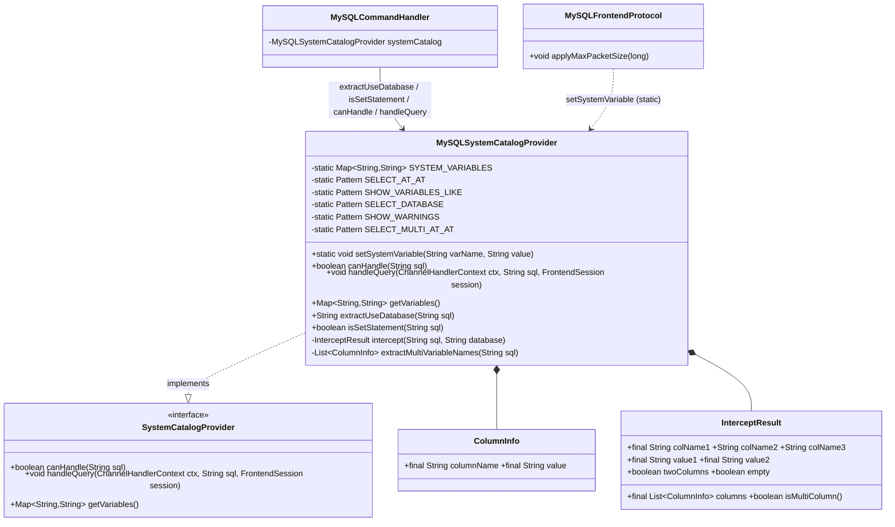
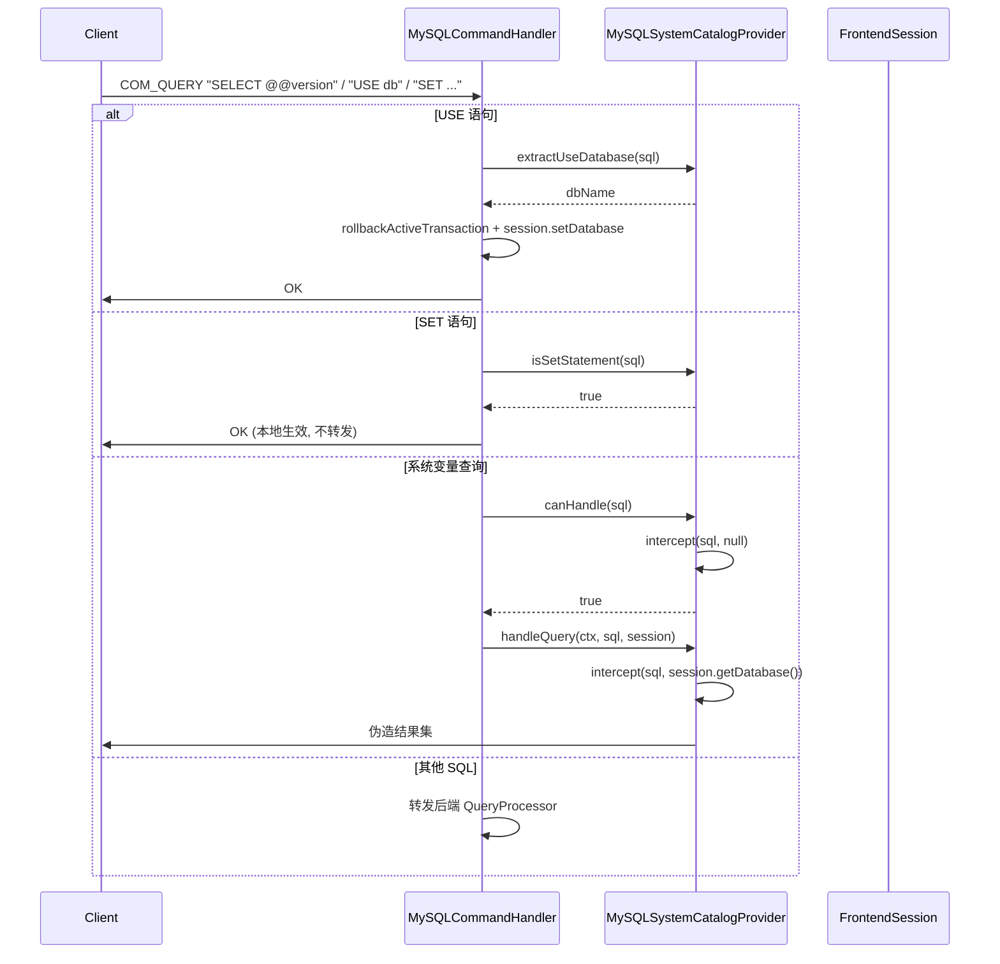

# 增量重构方案：合并 SystemVariableInterceptor → SystemCatalogProvider 体系

> 架构师：高见远（Gao）｜ 产出类型：**方案（不落盘代码，仅设计）**
> 主题：删除废弃类 `SystemVariableInterceptor`，将其逻辑合并进 `MySQLSystemCatalogProvider`，完成清理。

---

## 0. 实地核查结论（影响方案）

| 核查项 | 结果 |
|---|---|
| 测试代码是否引用 `SystemVariableInterceptor` | **无**。grep `**/src/test/**`（类名 + 全部方法名）均 0 命中。**删类安全，不会崩测试。** |
| `docs` 中确切提及位置 | `docs/system_design.md`：第 59、130、549 行；`docs/class-diagram.mermaid`：第 42、198 行；`docs/sequence-diagram.mermaid`：第 9 行（仅 `SystemCatalogProvider` 参与者）。 |
| `sdtp-core/.../core/intercept/SystemVariableInterceptor.java` | **不存在**（Glob 0 命中）。`AGENTS.md:34` 引用陈旧，真实废弃类只有 `sdtp-protocol-mysql/.../mysql/util/` 那一个。 |
| `MySQLCommandHandler` 持有字段类型 | `private final MySQLSystemCatalogProvider systemCatalog = new MySQLSystemCatalogProvider();`（line 77，**具体类**），可直接调其公有实例方法。 |
| `getVariables()`(MySQL provider) 是否有调用方 | **无**（MySQL 侧仅有定义 line 178）。第二份变量表当前是**死代码**。 |
| `applyMaxPacketSize` 调用时机 | `ProxyBootstrap:82` 在启动时、Netty 组创建**之前**调用一次 → 单线程写入窗口，并发风险低。 |

> ⚠️ 已知文档不一致：docs 类图中写为 `MySQLSystemCatalog`，真实类名是 `MySQLSystemCatalogProvider`。本次文档更新时一并纠正。

---

## 1. 目标与范围

**终态**：`SystemVariableInterceptor` 类被删除；其全部逻辑作为 `MySQLSystemCatalogProvider` 的成员存在；外部对废弃类的 3 处命令处理引用 + 1 处前端协议引用改写为对 provider 的调用；`getVariables()` 直接返回共享变量表（消除第二份副本）；`applyMaxPacketSize` 的“配置一次、所有连接 `SELECT @@max_allowed_packet` 生效”语义保持不变。

**受影响**：`sdtp-protocol-mysql`（核心）、`sdtp-server`（仅注释）、`docs/`。
**不受影响**：`sdtp-protocol`（接口不改动）、`sdtp-protocol-pg`（未引用废弃类）、`sdtp-core`。

---

## 2. 目标设计

### 2.1 关键决策

1. **解析逻辑内移**：把 `SystemVariableInterceptor` 的正则、`intercept / isSetStatement / extractUseDatabase`、`ColumnInfo`、`InterceptResult` 全部移入 `MySQLSystemCatalogProvider`。
   - `extractUseDatabase(String)`、`isSetStatement(String)` → **公有实例方法**（命令处理器直接调用）。
   - `intercept(String sql, String database)` → **私有方法**（仅 `canHandle` 与 `handleQuery` 内部使用）。
   - `InterceptResult` / `ColumnInfo` → provider 的**私有静态内部类**（命令处理器不再引用，封装更干净）。
2. **共享变量表 + 全局生效语义**：
   - `private static final Map<String,String> SYSTEM_VARIABLES = new LinkedHashMap<>();`，`static {}` 按原顺序灌入全部变量。
   - `public static synchronized void setSystemVariable(String varName, String value)`（带 `toLowerCase`、null 保护）。
   - `getVariables()` 返回 `Collections.unmodifiableMap(new LinkedHashMap<>(SYSTEM_VARIABLES))`（快照副本，保序、防篡改）。
   - `applyMaxPacketSize` 改为 `MySQLSystemCatalogProvider.setSystemVariable("max_allowed_packet", String.valueOf(maxPacketSize))`。表为 `static` → 所有连接共享 → 全局语义**保持不变**。
3. **接口 `SystemCatalogProvider` 不新增方法**（保持协议无关性）。
4. **命令处理器三处引用改写**：
   - line 148 → `systemCatalog.extractUseDatabase(sql)`（USE 分支仍本地处理：保留 `rollbackActiveTransaction` + `session.setDatabase` + `writeOk` + `return`，**不下推**给 `handleQuery`，否则丢失 rollback 语义）。
   - line 224 → `systemCatalog.isSetStatement(sql)`（SET 分支本地 `recordSystemVarInterception` + `writeOk` + `return` 不变）。
   - line 233 系统变量块简化为：
     ```java
     if (systemCatalog.canHandle(sql)) {
         log.debug("Intercepted system variable query: {}", sql);
         CommandMetrics.recordSystemVarInterception();
         systemCatalog.handleQuery(ctx, sql, session);
         return;
     }
     ```
     消除命令处理器侧与 provider 内部 `intercept` 的跨边界双重处理。
   - 删除 `import ...util.SystemVariableInterceptor;`。
5. **`handleQuery` 内 USE/SET 死代码分支（line 55-69）**：建议**本次保留不动**（详见 §6 待确认 1）。对 MySQL 路径确为死代码，但作安全网无害；清理归入独立后续任务。

### 2.2 目标类图



### 2.3 目标时序图



---

## 3. 文件变更清单

| # | 文件 | 变更 | 要点 |
|---|---|---|---|
| 1 | `sdtp-protocol-mysql/.../mysql/catalog/MySQLSystemCatalogProvider.java` | 修改(核心) | 内移全部解析逻辑 + 静态表 + `static setSystemVariable`；`extractUseDatabase/isSetStatement` 公有化；`intercept` 私有化；内部类内移；`getVariables` 返共享表；删 import；更新 Javadoc。 |
| 2 | `sdtp-protocol-mysql/.../mysql/MySQLFrontendProtocol.java` | 修改 | `applyMaxPacketSize` 改调 `MySQLSystemCatalogProvider.setSystemVariable`；删 import；更新注释。 |
| 3 | `sdtp-protocol-mysql/.../mysql/command/MySQLCommandHandler.java` | 修改 | 3 处引用改 `systemCatalog.*`；系统变量块简化；删 import。 |
| 4 | `sdtp-protocol-mysql/.../mysql/util/SystemVariableInterceptor.java` | 删除 | 所有引用移除后删除（无测试依赖，已核实）。 |
| 5 | `sdtp-server/.../server/ProxyBootstrap.java` | 修改(注释) | line 81 注释改写。 |
| 6 | `docs/system_design.md` | 修改(文档) | 修正第 59/130/549 行；统一类名。 |
| 7 | `docs/class-diagram.mermaid` | 修改(文档) | `MySQLSystemCatalog` → `MySQLSystemCatalogProvider`；移除废弃类节点。 |
| 8 | `docs/sequence-diagram.mermaid` | 修改(文档) | 补 command handler → provider 调用（可选）。 |
| 9 | `AGENTS.md` | 修改(文档) | line 34 stale 引用更正（低优先级）。 |

> PG 侧 4 个文件**不改动**。

---

## 4. 有序任务清单（含依赖）

| ID | 任务 | 依赖 | 优先级 |
|---|---|---|---|
| **T1** | 合并逻辑进 `MySQLSystemCatalogProvider`（静态变量表、`setSystemVariable`、`extractUseDatabase/isSetStatement` 公有化、`intercept` 私有化、内部类内移、`getVariables` 返共享表） | — | P0 |
| **T2** | `MySQLFrontendProtocol.applyMaxPacketSize` 改调 provider | T1 | P0 |
| **T3** | `MySQLCommandHandler` 三处引用改写 + 系统变量块简化 | T1 | P0 |
| **T4** | 删除 `SystemVariableInterceptor.java`（grep 校验 0 生产引用后） | T1,T2,T3 | P0 |
| **T5** | 文档/注释同步 | T4 | P1 |
| **T6** | 构建 + 回归（`mvn -q -pl sdtp-protocol-mysql -am compile`；跑现有测试；协议级冒烟） | T1–T5 | P0 |

依赖：`T1 → {T2, T3} → T4 → T5 → T6`。

---

## 5. 风险与回归点

1. **静态表并发（低）**：`SYSTEM_VARIABLES` 非线程安全；`setSystemVariable` 仅启动期单线程调用，稳态只读 → 实际风险低。建议 `synchronized` + `getVariables()` 返回快照，彻底消除理论竞态。
2. **双重 intercept 收敛（低）**：跨边界双重已消除；provider 内 `canHandle`（检测）与 `handleQuery`（取值）各调一次，结果一致，行为无变化。
3. **USE rollback 语义（高·关键）**：USE 分支含 `rollbackActiveTransaction`，**务必保留在命令处理器本地**，勿下推给 `handleQuery`（其 USE 分支无 rollback）。
4. **`canHandle` 检测等价性（中）**：旧用 `intercept(sql, realDb) != null`；新用 `canHandle(sql)`。SET/USE 已提前 return，剩余 SQL 判定一致（`database` 只影响值不影响是否拦截）。
5. **边界行为必须回归**：`SHOW WARNINGS`（三列空结果集）、多列 `@@` 查询（Connector/J 8.0.33）、`SELECT @@x [LIMIT n]`、`SHOW VARIABLES LIKE 'x'`、`SELECT DATABASE()`（含 null → "NULL"）、注释前缀 `/* ... */` 剥离。
6. **删类编译校验**：T4 删除前全仓 grep `SystemVariableInterceptor` 仅剩 0 生产引用（文档除外）。

**§5 回归用例清单（T6 执行）**：
- `SELECT @@version` / `@@max_allowed_packet` / `@@sql_mode` → 伪造值
- `SHOW VARIABLES LIKE 'autocommit'` → 双列
- `SELECT DATABASE()`（先 USE 某库）→ 库名
- `SHOW WARNINGS` → 三列空
- `SELECT @@session.tx_isolation AS a, @@autocommit AS b` → 多列
- `USE db` → 切换 + OK（验证 rollback 未丢失）
- `SET autocommit=1` → 本地 OK、不转发
- 启动注入 `max_allowed_packet` 后，新连接 `SELECT @@max_allowed_packet` 返回配置值
- 跑 `sdtp-protocol-mysql` 现有单测 + 集成冒烟

---

## 6. 待确认问题（用户决策点）

1. 是否顺手清理 `handleQuery` 内 USE/SET 死代码分支（line 55-69）？【推荐：保留】
2. 是否把共享变量表抽成独立常量类以支持未来 PG 复用？【推荐：保持内部】
3. 接口 `SystemCatalogProvider` 是否新增 `extractUseDatabase` / `isSetStatement`？【推荐：不加】
4. `setSystemVariable` 并发策略：synchronized + 快照，还是沿用现状不加同步？【推荐：synchronized + 快照】

确认后进入实现（T1–T6，由工程师寇豆码实现、QA 严过关回归）。
