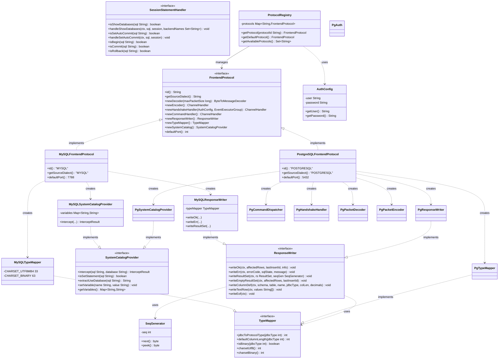
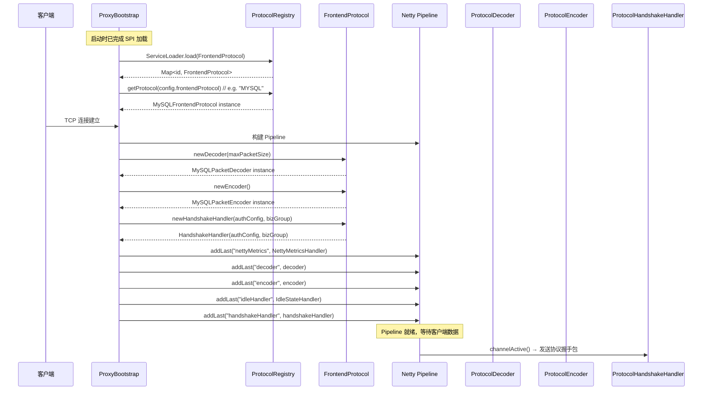
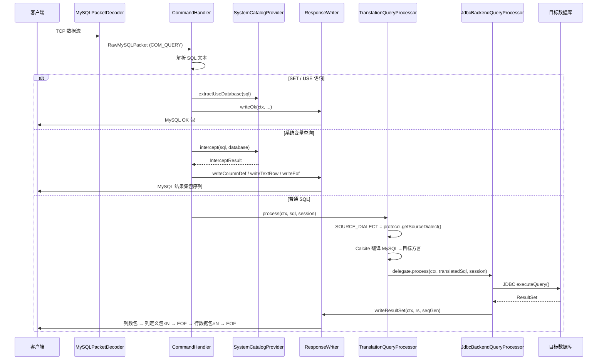
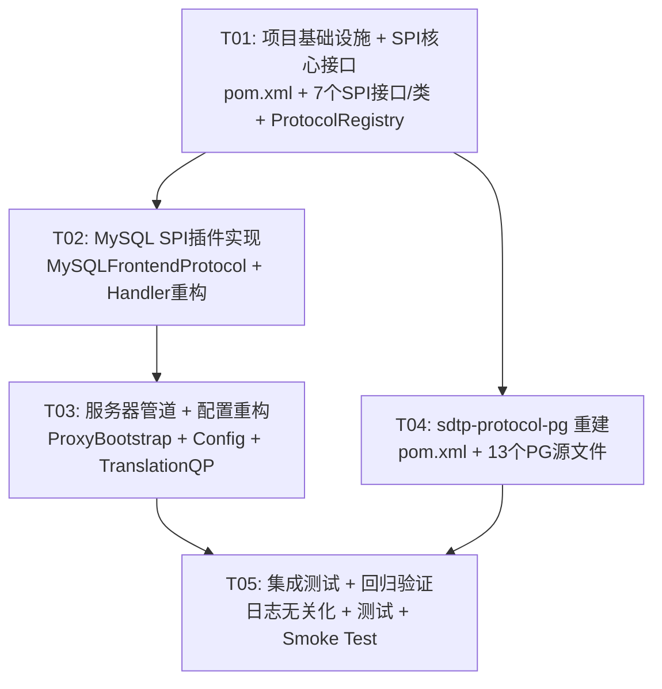

# SDT Proxy 协议层 SPI 解耦 — 系统架构设计文档

> **作者**：架构师 高见远（Bob）  
> **版本**：v1.0  
> **日期**：2025-07-19  
> **Java 版本约束**：Java 8（不支持 records、var）

---

## Part A：系统设计

---

## 1. 实现方案 + 框架选型

### 1.1 架构模式

采用 **SPI 插件架构（Service Provider Interface）**，以 "协议工厂模式" 解耦前端协议与代理核心。

```
┌──────────────────────────────────────────────────────┐
│                   sdtp-server (启动层)                 │
│  ProxyBootstrap ──→ ProtocolRegistry ──→ SPI 发现    │
│  ProxyConfig.frontendProtocol = "MYSQL" | "POSTGRESQL"│
└──────────────────────┬───────────────────────────────┘
                       │ 依赖 FrontendProtocol 接口
┌──────────────────────▼───────────────────────────────┐
│                 sdtp-core (抽象层)                     │
│  FrontendProtocol (SPI 接口，10个工厂方法)             │
│  AuthConfig, ResponseWriter, TypeMapper,              │
│  SystemCatalogProvider, SessionStatementHandler       │
│  ProtocolRegistry (ServiceLoader 加载器)              │
│  ├─ MySQLFrontendProtocol (内置 SPI 实现)             │
└──────────────────────┬───────────────────────────────┘
                       │
        ┌──────────────┴──────────────┐
        │                             │
┌───────▼────────┐          ┌────────▼───────────┐
│  sdtp-protocol │          │  sdtp-protocol-pg   │
│  (MySQL 编解码)│          │  (PG 编解码)        │
│  MySQLDecoder  │          │  PgPacketDecoder    │
│  MySQLEncoder  │          │  PgPacketEncoder    │
│  MySQLAuth     │          │  PgAuth             │
└────────────────┘          └────────────────────┘
```

**核心设计原则**：
- `sdtp-core` 定义 SPI 接口，实现类通过 `META-INF/services/` 注册
- 每个协议以独立模块提供，运行时按配置动态加载
- 现有 MySQL 处理器不做破坏性改动，而是作为第一个 SPI 插件 "内置" 到 sdtp-core
- `TranslationQueryProcessor` 的源方言从协议动态获取，消除硬编码

### 1.2 核心技术挑战与方案

| 挑战 | 方案 |
|------|------|
| **Java 8 无 module-info** | 使用 `java.util.ServiceLoader` + `META-INF/services/`，标准 JAR 级 SPI |
| **CommandHandler 硬编码 MySQL 包构造** | 抽取 `ResponseWriter` 接口，MySQL 实现 `MySQLResponseWriter` |
| **MySQLSystemCatalogProvider 硬编码 MySQL 变量** | 抽取 `SystemCatalogProvider` 接口，MySQL 实现 `MySQLSystemCatalogProvider` |
| **HandshakeHandler/AuthHandler 硬编码** | 改为通过 `FrontendProtocol` 工厂方法创建，接受 `AuthConfig` |
| **sdtp-protocol-pg 源码丢失** | 从 `.class` 反编译还原 13 个文件 |
| **现有功能不回归** | 所有 MySQL 逻辑封装到 `MySQLFrontendProtocol`，CommandHandler 内部重构但外部行为不变 |

### 1.3 SPI 加载方案

**选择 Java 原生 `java.util.ServiceLoader`**，理由：
- Java 8 标准库内置，零额外依赖
- `META-INF/services/` 是 JAR 打包的工业标准
- 所有构建工具（Maven/Gradle）原生支持
- Spring Boot、JDBC Driver 等均使用此方案，成熟可靠

---

## 2. 文件列表

### 2.1 新建文件

#### sdtp-core（SPI 接口 + MySQL 实现）

```
sdtp-core/src/main/java/com/translator/proxy/core/frontend/
├── FrontendProtocol.java           # SPI 核心接口（10个工厂方法）
├── AuthConfig.java                 # 认证配置 POJO
├── ResponseWriter.java             # 协议响应写入器接口
├── TypeMapper.java                 # 协议类型映射器接口
├── SystemCatalogProvider.java      # 系统目录/变量提供者接口
├── SessionStatementHandler.java    # 会话级语句处理接口
├── ProtocolRegistry.java           # SPI 服务发现 + 协议注册表
├── MySQLFrontendProtocol.java      # MySQL 协议 SPI 实现
├── MySQLResponseWriter.java        # MySQL 响应写入器实现
├── MySQLTypeMapper.java            # MySQL 类型映射器实现
└── MySQLSystemCatalogProvider.java         # MySQL 系统目录实现

sdtp-core/src/main/resources/META-INF/services/
└── com.translator.proxy.core.frontend.FrontendProtocol   # SPI 声明文件
```

#### sdtp-protocol-pg（PG 协议重建）

```
sdtp-protocol-pg/
├── pom.xml                                                    # Maven 模块描述
├── src/main/java/com/translator/proxy/protocol/pg/
│   ├── PgWire.java                                            # PG 线协议常量 + 工具方法
│   ├── PgMessage.java                                         # PG 消息类型枚举
│   ├── PgRawMessage.java                                      # PG 解码后原始消息
│   ├── PgPacketDecoder.java                                   # PG 协议拆包器
│   ├── PgPacketEncoder.java                                   # PG 协议封包器
│   ├── PgAuth.java                                            # PG 认证算法（MD5）
│   ├── PgOid.java                                             # PG OID 常量
│   ├── PgHandshakeHandler.java                                # PG 握手处理器
│   ├── PgCommandDispatcher.java                               # PG 命令分发器
│   ├── PgTypeMapper.java                                      # PG 类型映射器
│   ├── PgResponseWriter.java                                  # PG 响应写入器
│   ├── PgSystemCatalogProvider.java                           # PG 系统目录
│   └── PostgreSQLFrontendProtocol.java                        # PG SPI 实现
└── src/main/resources/META-INF/services/
    └── com.translator.proxy.core.frontend.FrontendProtocol    # SPI 声明文件
```

### 2.2 修改文件

```
sdtp-core/src/main/java/com/translator/proxy/core/handler/
├── CommandHandler.java          # 重构：使用 ResponseWriter + SystemCatalogProvider
├── HandshakeHandler.java        # 重构：接受 AuthConfig 参数
└── AuthHandler.java             # 重构：接受 AuthConfig 参数

sdtp-core/src/main/java/com/translator/proxy/core/intercept/
└── MySQLSystemCatalogProvider.java  # 已内联原 SystemVariableInterceptor 逻辑（废弃类已删除）

sdtp-backend/src/main/java/com/translator/proxy/backend/
├── TranslationQueryProcessor.java  # 修复：SOURCE_DIALECT 从协议动态获取
└── mapper/ResultSetEncoder.java    # 重构：使用 ResponseWriter 替代 MySQL 硬编码

sdtp-server/src/main/java/com/translator/proxy/server/
├── ProxyBootstrap.java             # 重构：管道初始化改为协议工厂模式
└── config/
    ├── ProxyConfig.java            # 新增：frontendProtocol 配置字段
    └── ConfigLoader.java           # 新增：解析 frontend-protocol YAML 键

pom.xml                             # 新增：sdtp-protocol-pg 模块声明
```

### 2.3 无删除文件

所有现有文件就地重构，不删除任何源文件，仅在方法签名和内部实现层面修改。

---

## 3. 数据结构和接口（Mermaid 类图）



---

## 4. 程序调用流程（Mermaid 时序图）

### 4.1 新连接建立 — 协议选择与 Pipeline 构建



### 4.2 SQL 查询完整处理链路



---

## Part B：任务分解

---

## 5. 依赖包列表

### 根 pom.xml 变更

```xml
<!-- 新增模块 -->
<module>sdtp-protocol-pg</module>
```

### sdtp-core/pom.xml — 无新增依赖

SPI 接口仅依赖 Java 标准库，Factory 方法返回 Netty 类型（Netty 已在依赖链中）。

### sdtp-protocol-pg/pom.xml — 新建

```xml
<parent>
    <groupId>com.draven.sql.translator</groupId>
    <artifactId>sql-dialect-translator</artifactId>
    <version>1.0.0-SNAPSHOT</version>
</parent>
<artifactId>sdtp-protocol-pg</artifactId>
<name>SDTP Protocol — PostgreSQL</name>
<description>PostgreSQL wire protocol: codec, auth (MD5), handshake, command dispatch</description>
<dependencies>
    <dependency>
        <groupId>com.draven.sql.translator</groupId>
        <artifactId>sdtp-core</artifactId>
        <version>${project.version}</version>
    </dependency>
    <dependency>
        <groupId>io.netty</groupId>
        <artifactId>netty-all</artifactId>
    </dependency>
    <dependency>
        <groupId>org.slf4j</groupId>
        <artifactId>slf4j-api</artifactId>
    </dependency>
    <dependency>
        <groupId>junit</groupId>
        <artifactId>junit</artifactId>
        <scope>test</scope>
    </dependency>
</dependencies>
```

### sdtp-server/pom.xml — 新增依赖

```xml
<!-- 新增：PG 协议模块（运行时协议选择） -->
<dependency>
    <groupId>com.draven.sql.translator</groupId>
    <artifactId>sdtp-protocol-pg</artifactId>
    <version>${project.version}</version>
</dependency>
```

**关键说明**：sdtp-server 不直接依赖 PG 具体类，仅需将 JAR 纳入 classpath 使 SPI 能发现。`ProtocolRegistry` 通过 `ServiceLoader` 动态加载。

---

## 6. 任务列表（按依赖顺序）

| 任务 | ID | 描述 | 涉及文件 | 依赖 | 优先级 |
|------|----|------|----------|------|--------|
| **项目基础设施 + SPI 核心接口** | T01 | 1) 根 pom 添加 sdtp-protocol-pg 模块；2) 创建 SPI 核心接口和辅助类（7个文件）；3) 创建 ProtocolRegistry 加载器；4) SPI 服务发现配置文件 | `pom.xml`, `sdtp-core/.../frontend/FrontendProtocol.java`, `AuthConfig.java`, `ResponseWriter.java`, `TypeMapper.java`, `SystemCatalogProvider.java`, `SessionStatementHandler.java`, `ProtocolRegistry.java`, `SeqGenerator.java`, `META-INF/services/com.translator.proxy.core.frontend.FrontendProtocol` | 无 | P0 |
| **MySQL SPI 插件实现** | T02 | 1) 实现 MySQLFrontendProtocol（10个工厂方法）；2) 实现 MySQLResponseWriter（从 CommandHandler/AuthHandler/ResultSetEncoder 抽取 MySQL 包构造逻辑）；3) 实现 MySQLTypeMapper（包装现有 TypeMapper）；4) 实现 MySQLSystemCatalogProvider（从 SystemVariableInterceptor 迁移）；5) 重构 HandshakeHandler/AuthHandler 接受 AuthConfig；6) 重构 CommandHandler 使用 ResponseWriter + SystemCatalogProvider | `sdtp-core/.../frontend/MySQLFrontendProtocol.java`, `MySQLResponseWriter.java`, `MySQLTypeMapper.java`, `MySQLSystemCatalog.java`; `sdtp-core/.../handler/CommandHandler.java`, `HandshakeHandler.java`, `AuthHandler.java`; `sdtp-core/.../intercept/SystemVariableInterceptor.java` | T01 | P0 |
| **服务器管道 + 配置重构** | T03 | 1) ProxyBootstrap 重构为协议工厂模式（从 ProtocolRegistry 获取协议构建 Pipeline）；2) ProxyConfig 新增 frontendProtocol 字段；3) ConfigLoader 解析 frontend-protocol；4) TranslationQueryProcessor 消除 SOURCE_DIALECT 硬编码（从协议获取）；5) ResultSetEncoder 重构使用 ResponseWriter | `sdtp-server/.../ProxyBootstrap.java`; `sdtp-server/.../config/ProxyConfig.java`, `ConfigLoader.java`; `sdtp-backend/.../TranslationQueryProcessor.java`, `mapper/ResultSetEncoder.java` | T02 | P0 |
| **sdtp-protocol-pg 模块重建** | T04 | 1) 创建 pom.xml；2) 从 .class 反编译还原 13 个 PG 源文件；3) PostgreSQLFrontendProtocol SPI 注册；4) 端口适配（PG 默认 5432）| `sdtp-protocol-pg/pom.xml` + 全部 `src/main/java/.../pg/*.java`（13个） + `META-INF/services/...FrontendProtocol` | T01 | P1 |
| **集成测试 + 回归验证** | T05 | 1) 日志协议无关化（移除 "MySQL Proxy" 等字样）；2) 编写 SPI 加载集成测试；3) 端到端回归测试（MySQL 客户端连接 → SQL 翻译 → 结果返回）；4) PG 协议 Smoke Test（PG 客户端连接基本验证）| `sdtp-server/.../ProxyBootstrap.java`（日志修改）; `sdtp-core/src/test/.../ProtocolRegistryTest.java`; `sdtp-server/src/test/.../ProxyBootstrapTest.java`; `sdtp-protocol-pg/src/test/.../*Test.java` | T03, T04 | P0 |

---

## 7. 任务依赖图



---

## 8. 共享知识（跨文件约定）

### 8.1 包命名约定

| 包路径 | 用途 |
|--------|------|
| `com.translator.proxy.core.frontend` | SPI 接口 + 辅助接口 + ProtocolRegistry |
| `com.translator.proxy.core.frontend` | MySQL SPI 实现类（内置在 sdtp-core） |
| `com.translator.proxy.protocol.pg` | PG SPI 实现类（在 sdtp-protocol-pg） |
| `com.translator.proxy.protocol.codec` | MySQL 线协议编解码（不动） |
| `com.translator.proxy.core.handler` | Netty Handler（重构但不搬迁） |

### 8.2 接口契约约定

- **`FrontendProtocol.id()`** 返回大写协议标识符，如 `"MYSQL"`、`"POSTGRESQL"`
- **`FrontendProtocol.getSourceDialect()`** 返回 OpenLR 方言标识符，如 `"MYSQL"`、`"POSTGRESQL"`
- **所有 Handler 实现** 必须接受 `AuthConfig` 而非裸 `String user, String password`
- **`ResponseWriter.writeResultSet()`** 负责完整的结果集编码（列数→列定义→EOF→行→EOF）
- **`SystemCatalogProvider.intercept()`** 返回 null 表示 "不拦截，正常转发"

### 8.3 SPI 注册约定

- SPI 文件路径：`META-INF/services/com.translator.proxy.core.frontend.FrontendProtocol`
- 每行一个实现类的全限定名
- 示例：
  ```
  com.translator.proxy.core.frontend.MySQLFrontendProtocol
  ```
- 运行时，`ProtocolRegistry` 使用 `ServiceLoader.load(FrontendProtocol.class)` 加载全部实现

### 8.4 错误处理约定

- **SPI 加载失败**：记录 WARN 日志，继续加载其余协议；若没有任何协议可用则抛 `IllegalStateException`
- **协议不存在**：`ProtocolRegistry.getProtocol("UNKNOWN")` 返回 null，调用方负责检查
- **翻译降级**：`TranslationQueryProcessor` 翻译失败时自动降级为原始 SQL 直通（保持现有行为）
- **认证失败**：通过 `ResponseWriter.writeErr()` 发送协议标准的错误包

### 8.5 配置约定

```yaml
# proxy-config.yml 新增字段
proxy:
  port: 3306
  frontend-protocol: MYSQL    # 新增：前端协议标识，默认 "MYSQL"
  auth:
    user: root
    password: proxy_password
```

- 默认值：`"MYSQL"`（向后兼容）
- 可选值：`"MYSQL"` | `"POSTGRESQL"`
- `ConfigLoader` 从 `proxy.frontend-protocol` 键读取

### 8.6 日志约定

- 启动日志从 `"MySQL Proxy started on port {}"` 改为 `"SDT Proxy started on port {} (protocol: {})"`
- 所有 Handler 日志中移除 "MySQL" 字样或改为从协议动态获取

---

## 9. 待明确事项

| # | 问题 | 当前假设 |
|---|------|----------|
| 1 | **PG 协议认证插件**：PgAuth 使用 MD5 还是 SCRAM-SHA-256？ | 假设使用 MD5（`pg_sasl_md5`），与 PG 10+ 兼容的最简方案 |
| 2 | **PG 协议 SSL 支持**：PgHandshakeHandler 是否需要 SSLRequest 处理？ | 假设第一版不支持 SSL，直接拒绝 SSLRequest |
| 3 | **PG 协议与 TranslationQueryProcessor 集成**：PG 客户端查询是否走翻译？ | 假设 PG 协议模式下源方言=POSTGRESQL，不翻译（直通） |
| 4 | **CommandHandler.QueryProcessor 接口**：是否从 CommandHandler 内部接口提升为顶级接口？ | 假设保持在 CommandHandler 内部（向后兼容），后续迭代再提升 |
| 5 | **MySQLSystemCatalogProvider 兼容性**：原逻辑已合并，静态方法是否保留？ | 已合并原 SystemVariableInterceptor 逻辑；`setSystemVariable` 保留为 public static synchronized，`getVariables` 返回不可变快照 |
| 6 | **sdtp-protocol-pg 反编译准确度**：.class 文件是否能完整还原？ | 假设核心逻辑可从字节码准确还原，边缘 case 通过集成测试补全 |

---

> **向 Engineer 说明**：本设计文档中的 `Mermaid` 类图和时序图已同时输出为独立文件：
> - `docs/class-diagram.mermaid`
> - `docs/sequence-diagram.mermaid`
> 
> 实现时请严格按照 T01→T02→T03→T04→T05 的顺序推进，每个任务完成后执行 `mvn compile test-compile` 确保编译通过。
